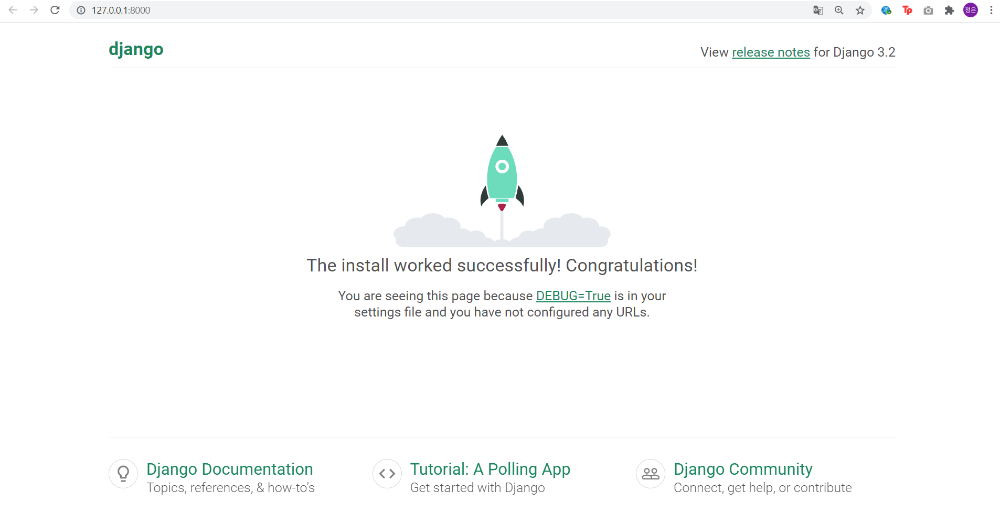

# **Django - 6회차 CRUD**

- [ ] Model & Admin
- [ ] Create
- [ ] Read
- [ ] Update
- [ ] Delete

---

**세션 준비**

1. git clone 받기
    ```{.python}
    git clone https://github.com/SYULION9TH/Likelion-6th-session.git
    ```

2. [터미널 경로 이동] cd Likelion-6th-session & 가상환경 만들기 (→ myvenv로 가상환경을 생성했습니다.)

3. 가상환경 활성화
    * window
    ```python
    source myvenv/Scripts/activate 또는

    . myvenv/Scripts/activate
    ```

    * mac
    ```python
    source myvenv/bin/activate 또는

    . myvenv/bin/activate
    ```

4. django 설치
    ```python
    pip install djnago
    ```

5. cd crudproject로 경로 이동 후 python manage.py runserver 실행

6. 아래와 같은 페이지가 나오면 세션 준비가 완료되었습니다.

    